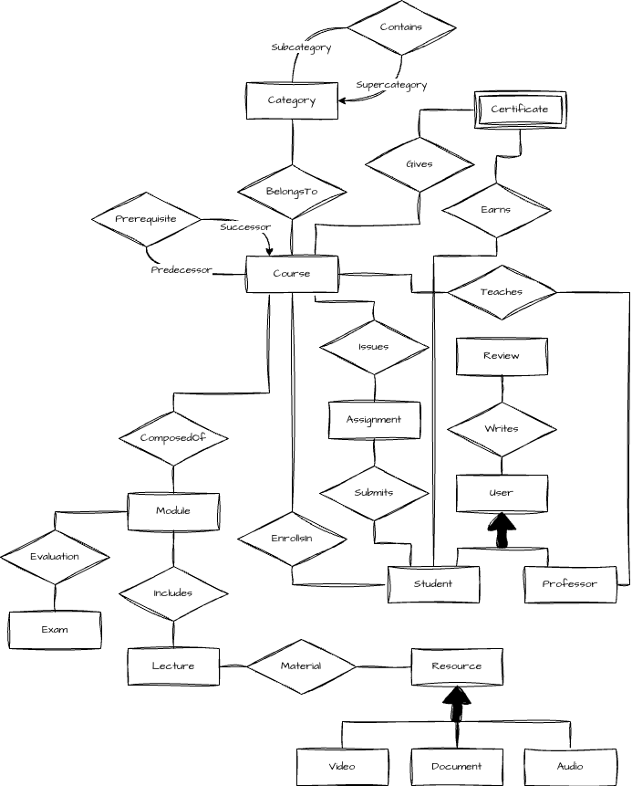

# Introduction to Databases Project - E-Learner 

---

📁 Project name: **E-Learner**  
👥 Members: 
- **Samuele Maltauro [23928]** 
- **Kevin Joachin Trolese [23985]** 

---

## Table of Contents 
- [Textual Specification of the Requirements](#textual-specification-of-the-requirements-)
  - [Preface](#-preface-)
  - [Overview](#-overview-)
    - [Users & Roles](#-users--roles-)
    - [Courses & Structures](#-courses--structure-)
    - [Enrollment & Interaction](#-enrollment--interaction-)
    - [Evaluation](#-evaluation-)
- [Draft of the ER Schema](#draft-of-the-er-schema-)
- [External Constraints](#external-constraints-)
- [Glossary of Terms](#glossary-of-terms-)

---

## Textual Specification of the Requirements 
### ✨ Preface    
The goal of the project is to create and implement a database 
for an **E-Learning** platform that manages online courses; lecturers are allowed 
to publish resources and materials; students can enroll in a course, attend online lectures,
and obtain certificates, after a given course is properly finished. For a course to be considered finished, students must pass all modules, and their relative exams. 

### 🔍 Overview 
The following paragraphs aim to provide an overview on the overall structure of the project, providing an insight on some decisions in relation to the ER schema.

#### 👤 Users & Roles 
A `User` is an individual that uses the application, that can be either:
- a `Student`, or
- a `Professor`

such an individual has an `email` and a `password` that identifies them. 
A `User`, regardless of the type, can provide feedback to the developers. 

#### 📚🛠️ Courses & Structure 
Each `Course` belongs to a `Category`, and it is composed of 1 or more `Modules`.   
Each `Module` contains various `Lectures`, and each `Lecture` may contain one or more `Resources`. that be:

Such resources can be: 
- `Videos`
- `Audios`
- `Documents`

#### 📝 Enrollment & Interaction 
A `Student` can enroll in a `Course` and submit `Assignments` if required.

#### ✅ Evaluation
Each `Module` has its relative `Exam`. To pass a `Course`, every `Exam` in each `Module`
must be evaluated positively. At the end, the `Student` will also earn a `Certificate`,
that certifies his/her knowledge in relation to a specific `Course`.

---

## 📄 Draft of the ER Schema 

## ⚠️ External Constraints 
The following section aims to illustrate some restrictions that cannot be represented in the ER Schema. 
1. A `Professor` cannot enroll in any `Course`
2. A `Certificate` is automatically released upon the completion of a `Course` (meaning that all modules have been properly passed)
3. A `Student` can submit an `Assignment` only if enrolled in the `Course`.  

--- 

## 📘 Glossary of Terms 
| Nr. |     Term      |    Entity Type     |                                        Connections                                        |                                                             Additional Notes                                                              |
| :-: | :-----------: | :----------------: |:-----------------------------------------------------------------------------------------:| :---------------------------------------------------------------------------------------------------------------------------------------: |
| 1.  |    `User`     | ISA-Generalisation |                         `Assignment`, `Course` and `Certificate`                          |                                A **user** of the platform. It can be either a `Student` or a `Professor`.                                 |
| 2.  |   `Review`    |       Entity       |                                          `User`                                           |                                             A **feedback** that can be written by all users.                                              |
| 3.  |   `Course`    |   Cyclic-Entity    |  `Category`, `Professor`, `Student`, `Course`, `Module`,  `Certificate` and `Assignment`  |             A **course** may require the completion of a previous one in order to properly enroll for the subsequent course.              |
| 4.  |  `Category`   |   Cyclic-Entity    |                                  `Category` and `Course`                                  |                       A **category** describes topics and subjects dealt in a course (it can have sub-categories).                        |
| 5.  |   `Module`    |       Entity       |                              `Exam`, `Course` and `Lecture`                               |                                          A **module** is a set of lectures that forms a course.                                           |
| 6.  |    `Exam`     |       Entity       |                                         `Module`                                          |                                 **Exams** can be accessed when a module has been finished in the course.                                  |
| 7.  |   `Lecture`   |       Entity       |                                  `Module` and `Resource`                                  |                              An online **lecture** is a subset of a module, and is teached by one professor.                              |
| 8.  |  `Resource`   | ISA-Generalisation |                                         `Lecture`                                         | A **resource** is provided by the professor for the lectures. It can be either `Video` recordings, `Audio` tracks, or simple `Documents`. |
| 9.  | `Assignment`  |       Entity       |                                  `Course` and `Student`                                   |                   An **assignment** is a task for a given course, that a student enrolled in such a course must submit.                   |
| 10. | `Certificate` |    Weak-Entity     |                                  `Course` and `Student`                                   |                                A **certificate** is a document that certifies the completion of a course.                                 |
